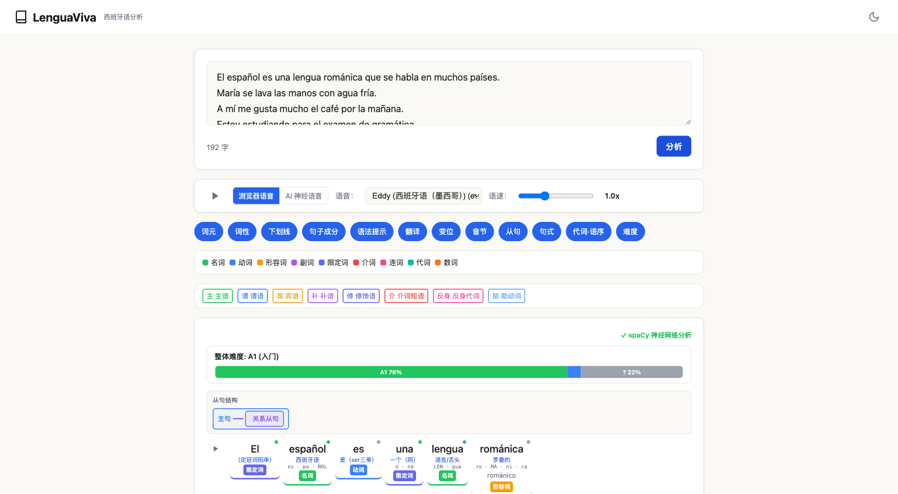
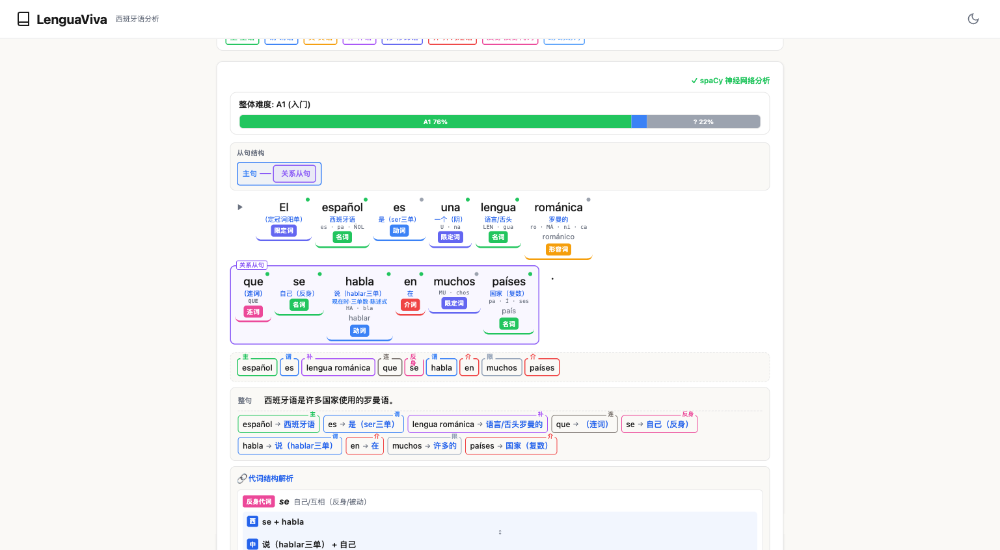
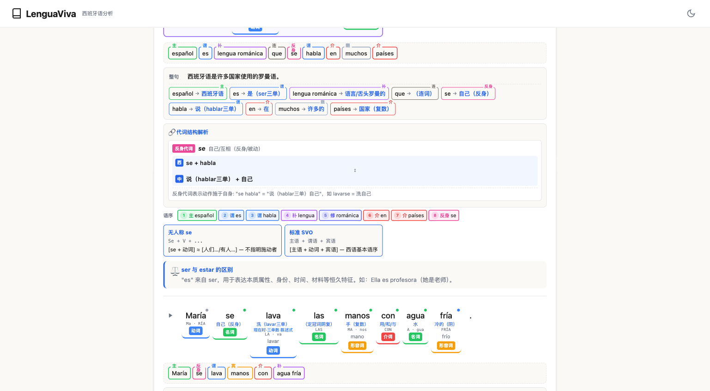
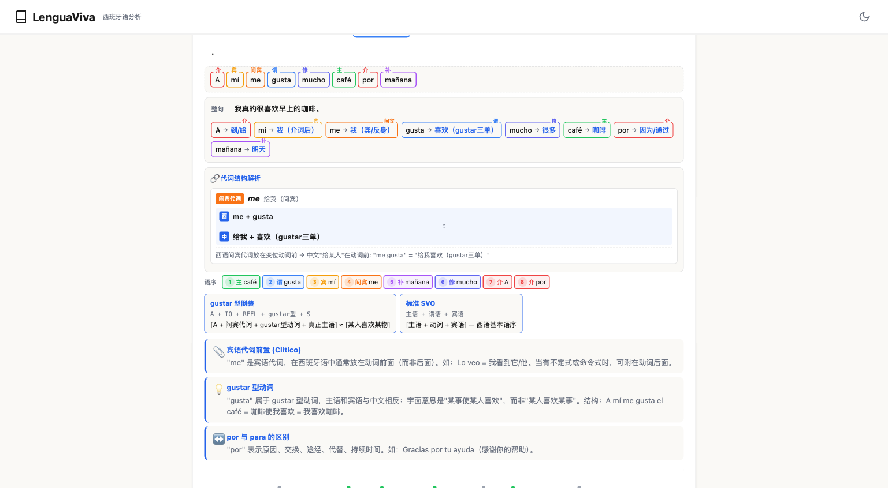
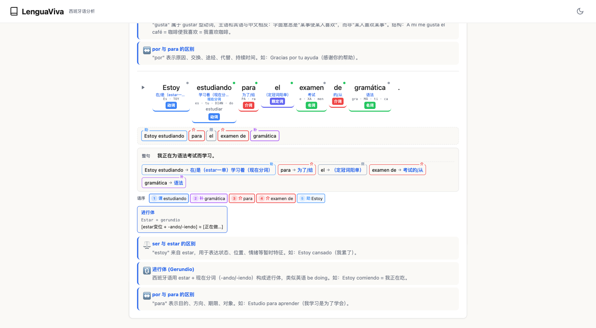
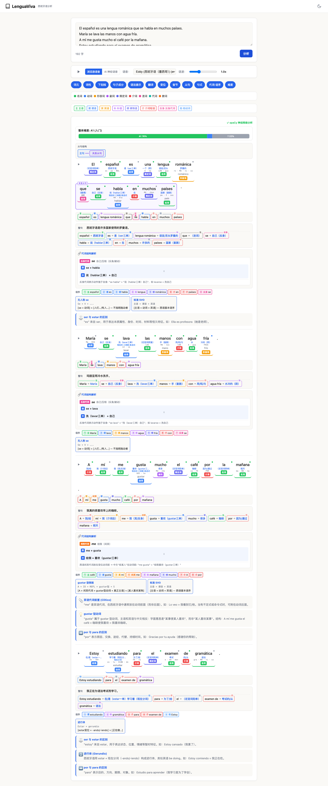

# LenguaViva — 西班牙语文本分析工具

> **⚠️ 测试版本** — 本项目仍在开发中，分析结果可能存在错误，仅供学习参考。

LenguaViva 是一款面向中文母语者的西班牙语文本分析工具。输入任意西班牙语文本，即可获得词性标注、句子成分解析、从句结构、动词变位、语法注释等多维度分析，帮助理解西班牙语句子结构。

## 界面预览

### 输入与控制面板



输入西班牙语文本后点击"分析"，即可看到完整的分析结果。顶部提供 TTS 语音朗读（浏览器原生语音 / 微软 AI 神经语音）、功能开关（词元、词性、下划线、句子成分、语法提示、翻译、变位、音节、从句、句式、代词·语序、难度），以及词性和句子成分的颜色图例。

### 词性标注 + 句子成分 + 从句结构



每个词下方标注词性（彩色标签：名词、动词、形容词等）和词元信息。句子成分条以简化的 SVO 形式展示（主语、谓语、宾语、修饰语等）。从句结构通过缩进和边框可视化，自动识别关系从句、条件从句等类型。上方的 CEFR 难度条显示词汇分布（A1–C2）。

### 翻译 + 代词结构解析



整句翻译为中文，每个词附带对应的中文释义和语法角色标注。代词结构解析模块自动识别反身代词（se）、间接宾语代词（me/te/le）等结构，给出西语结构、中文对照和语法规则说明。

### 语法提示 + gustar 型动词



语法提示模块针对常见的学习难点自动生成说明，包括：
- **宾语代词前置** — "me" 等宾格代词在动词前的用法
- **gustar 型动词** — 主语和宾语与中文相反的特殊句型
- **ser 与 estar 的区别** — 根据上下文提示使用场景
- **por 与 para 的区别** — 介词用法对比
- **进行体 (Gerundio)** — estar + 现在分词的结构说明

### 动词变位 + 句式识别



动词变位分析显示每个动词的时态、语气、人称和词元。句式识别模块自动检测进行体（estar + gerundio）、被动语态、反身结构等常见句型，并以卡片形式展示公式和中文对照。

### 全页概览



## 功能列表

| 功能 | 说明 |
|------|------|
| **词性标注** | 彩色高亮显示名词、动词、形容词、副词、限定词、介词、连词、代词、数词 |
| **句子成分分析** | 基于 spaCy 神经网络引擎标注主语、谓语、宾语、补语、修饰语、介词短语、反身代词、助动词 |
| **从句结构可视化** | 自动识别关系从句、条件从句、原因从句、时间从句、让步从句等，树状缩进展示 |
| **动词变位分析** | 显示时态（现在、过去、将来等）、语气（直陈、虚拟、命令）、人称，附中文说明 |
| **构词法分析** | 拆解前缀、后缀、词根，标注词缀含义 |
| **音节与重音** | 标注音节划分和重音位置（重音音节高亮） |
| **代词·语序分析** | 分析宾格/与格/反身代词结构（me/te/se/lo/le 等），简化 SVO 语序标注 |
| **CEFR 难度标注** | 词汇和语法结构的 A1–C2 等级标注，分布条可视化 |
| **生词本** | 点击任意词可加入生词本，内置 SM-2 间隔重复复习系统 |
| **翻译** | 整句中文翻译 + 逐词释义对照 |
| **语音朗读** | 浏览器原生 TTS 及微软 Edge 神经网络语音，可调语速 |
| **语法提示** | 自动检测 ser/estar 区别、por/para 用法、gustar 型动词、进行体等常见难点 |

## 安装与启动

### 前置要求

- Python 3.10+
- 现代浏览器（推荐 Chrome / Edge）

### 步骤

```bash
# 1. 克隆仓库
git clone https://github.com/econws/LenguaViva.git
cd LenguaViva

# 2. 创建虚拟环境并安装依赖
python -m venv venv
source venv/bin/activate   # Windows: venv\Scripts\activate
pip install -r requirements.txt

# 3. 下载 spaCy 西班牙语模型
python -m spacy download es_core_news_md

# 4. 启动服务器
python server.py
```

打开浏览器访问 `http://localhost:5001`，即可使用。

> **注意：** 如果 spaCy 后端未启动，工具会自动回退到客户端规则分析（准确度较低），页面上会显示引擎状态提示。

## 技术栈

- **前端** — 纯 HTML/CSS/JavaScript，使用 [es-compromise](https://github.com/nlp-compromise/es-compromise) 进行客户端分词
- **后端** — Python Flask + [spaCy](https://spacy.io/)（`es_core_news_md` 模型）提供依存句法分析
- **翻译** — MyMemory API
- **语音** — Web Speech API + Edge TTS

## 致谢

本项目的前端架构受 [Fudoki](https://github.com/iamcheyan/fudoki)（日语文本分析工具，MIT 许可）启发。西班牙语分析模块、语法引擎、spaCy 后端等核心功能为独立开发。

## 许可

[MIT License](LICENSE)
